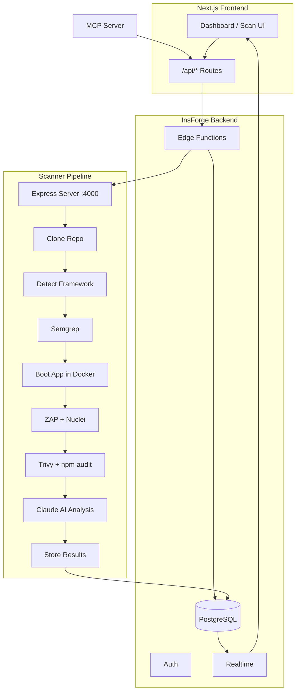

# ASEC

**Autonomous Security Scanner** — Paste a GitHub URL, get a full security report with AI-generated fixes. No security expertise required.

## Features

- **Multi-Scanner Pipeline** — SAST (Semgrep), DAST (OWASP ZAP + Nuclei), and SCA (Trivy + npm audit) in a single scan
- **AI-Powered Triage & Fixes** — Claude analyzes findings, explains them in plain language, and generates code fixes
- **Real-Time Dashboard** — Watch scan progress live with severity breakdowns and filterable findings
- **Export Reports** — Download full JSON reports for compliance or sharing
- **REST API** — Programmatic access to start scans, query findings, and pull reports
- **MCP Server** — Native integration with AI assistants (Claude Code, Cursor, Qoder) via Model Context Protocol
- **Secure Auth** — Email + OTP verification powered by InsForge

## Architecture



### Pipeline Flow

1. User pastes a GitHub URL in the dashboard
2. Next.js API route calls the InsForge `start-scan` edge function
3. Edge function creates a `scan_jobs` row and triggers the scanner server
4. Scanner pipeline runs each stage sequentially:
   - **Clone** the repository
   - **Detect** the framework/language
   - **SAST** — static analysis with Semgrep
   - **Boot** — start the app in Docker for dynamic testing
   - **DAST** — dynamic analysis with ZAP and Nuclei
   - **SCA** — dependency scanning with Trivy and npm audit
   - **AI Analysis** — Claude triages findings and generates fixes
5. Results stream to the dashboard in real-time via WebSocket
6. Findings are displayed with severity badges, file locations, and AI-generated fix diffs

## Quick Start

### Prerequisites

- Node.js 18+
- Docker (for scanner tools: Semgrep, ZAP, Nuclei, Trivy)
- An InsForge account ([insforge.dev](https://insforge.dev))

### 1. Clone and Install

```bash
git clone https://github.com/Zuriahn-Yun/ASEC.git
cd ASEC
npm install
```

### 2. Configure Environment

Create `.env.local` in the project root:

```env
NEXT_PUBLIC_INSFORGE_BASE_URL=https://your-project.insforge.app
NEXT_PUBLIC_INSFORGE_ANON_KEY=your-anon-key
```

Create `packages/scanner/.env`:

```env
INSFORGE_BASE_URL=https://your-project.insforge.app
INSFORGE_ANON_KEY=your-anon-key
PORT=4000
```

### 3. Set Up the Database

```bash
cd packages/backend
npm install
npm run setup-db
```

### 4. Start Development Servers

**Terminal 1 — Frontend:**
```bash
npm run dev
```

**Terminal 2 — Scanner:**
```bash
cd packages/scanner
npm install
npm run dev:server
```

Open [http://localhost:3000](http://localhost:3000), sign up, and start scanning.

## API Reference

All endpoints require `Authorization: Bearer <token>` header.

| Method | Endpoint | Description |
|--------|----------|-------------|
| `POST` | `/api/scan` | Start a new scan. Body: `{ "repo_url": "https://github.com/...", "branch": "main" }` |
| `GET` | `/api/scan/[id]` | Get scan status and metadata |
| `GET` | `/api/scan/[id]/findings` | List findings. Query: `?severity=high&scan_type=sast` |
| `GET` | `/api/scan/[id]/summary` | Severity breakdown counts |
| `GET` | `/api/scan/[id]/report` | Full JSON report (scan + findings + fixes) |

### Example

```bash
# Start a scan
curl -X POST http://localhost:3000/api/scan \
  -H "Content-Type: application/json" \
  -H "Authorization: Bearer $TOKEN" \
  -d '{"repo_url": "https://github.com/owner/repo"}'

# Get findings
curl http://localhost:3000/api/scan/$SCAN_ID/findings \
  -H "Authorization: Bearer $TOKEN"
```

## MCP Integration

Add ASEC to your AI assistant config to scan repos and review findings from your editor.

### Claude Code / Cursor / Qoder

Add to your MCP settings:

```json
{
  "mcpServers": {
    "asec": {
      "command": "npx",
      "args": ["@asec/mcp-server"],
      "env": {
        "ASEC_API_URL": "http://localhost:3000",
        "ASEC_TOKEN": "your-auth-token"
      }
    }
  }
}
```

### Available MCP Tools

| Tool | Description |
|------|-------------|
| `scan_repository` | Start a security scan on a GitHub URL |
| `get_scan_status` | Check if a scan is still running |
| `list_findings` | Get findings with plain-language explanations |
| `get_finding_detail` | Deep dive on one finding with AI fix |
| `get_fix` | Get AI-generated fix code for a finding |
| `explain_severity` | Explain what a severity level means |

## Tech Stack

| Layer | Technology |
|-------|------------|
| Frontend | Next.js 15, TypeScript, Tailwind CSS 3.4 |
| Backend | InsForge (PostgreSQL, Auth, Realtime, Edge Functions) |
| Scanner | Node.js, Express, Docker |
| SAST | Semgrep |
| DAST | OWASP ZAP, Nuclei |
| SCA | Trivy, npm audit |
| AI | Claude (via InsForge AI) |
| Protocol | MCP (Model Context Protocol) |

## Project Structure

```
src/                          # Next.js frontend
├── app/                      # App router pages
│   ├── api/start-scan/       # API proxy route
│   ├── dashboard/            # Main dashboard
│   ├── scan/[id]/            # Scan detail view
│   ├── scan/new/             # New scan form
│   ├── sign-in/              # Auth pages
│   └── sign-up/
├── components/               # React components
│   ├── DiffViewer.tsx        # Side-by-side code diff
│   ├── FindingDetail.tsx     # Finding slide-over panel
│   ├── FindingsTable.tsx     # Filterable findings table
│   ├── SeverityBadge.tsx     # Severity level badge
│   └── SeverityChart.tsx     # Severity pie chart
└── lib/                      # Utilities
    ├── insforge.ts           # InsForge SDK client
    └── useScanRealtime.ts    # Realtime subscription hook

packages/
├── scanner/                  # Security scanner pipeline
│   └── src/
│       ├── server.ts         # Express server (port 4000)
│       ├── orchestrator.ts   # Pipeline orchestration
│       ├── scanners/         # Scanner wrappers
│       ├── ai-analyzer.ts    # Claude-powered analysis
│       └── reporter.ts       # Results reporter
├── backend/                  # InsForge serverless
│   ├── functions/start-scan/ # Edge function
│   └── scripts/setup-db.ts  # DB schema setup
├── shared/                   # Shared TypeScript types
│   └── types/                # ScanJob, ScanFinding, Fix, etc.
└── mcp-server/               # MCP server for AI assistants
    └── src/
        ├── index.ts          # MCP stdio entry
        ├── tools.ts          # Tool definitions
        └── api-client.ts     # ASEC REST API client
```

## Team

- **Jack** — Frontend, coordination, integration
- **Zuriahn** — Scanner pipeline, backend functions, frontend components
- **Anderson** — Backend, API, deployment

---

Built for the InsForge Hackathon 2025.
